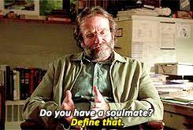

# Chat Sentiment Analysis Service with API
## Ironhack's Data Analytics Bootcamp Project nº V: Chat API

The **main goal** of this project is to create an API to store and analyze chat messages and create sentiment metrics.

Primary goal:
- Create an API with *flask* that stores chat messages in a database. I have chosen **MongoDB Compass**.

Secondary goal:
- Extract sentiment from chat messages and perform a report over a whole conversation using **NLTK sentiment analysis**.
---
## Choosing a topic
When brainstorming about a topic to create a chat-box, I first wanted to showcase a dialogue from "The Queen Gambit" series that I have just finished watching and have absolutely loved (I am also kind of obsessed, *kind of*). However, thinking it through (whoever has seen the series will know what I am talking about), the dialogues during the tournaments don't have a lot of sentimental load, which is why I decided to switch.

"Good Will Hunting" inmediately came to mind, since Robin Williams is the master at having philosophical and therefore, sentimental, conversations in his movies.

The fragment of dialogue I decided to insert into my database is sourced from this [link](https://www.goodreads.com/work/quotes/183901-good-will-hunting-a-screenplay). For those who haven't watched the movie (highly recommend watching it), it is a conversation between Will (Matt Damon) and Sean (Robin Williams), who is Will's therapist, or as he likes to call him, his "shrink".

## Database Structure
I first created the skeleton of the database. To do so, I created 3 empty collections named: user, chat, messages.

## Creating the API and its endpoints
Once the structure was in place, I proceeded to create the APPI with *flask* and then different endpoints to meet the requirements of the project. While creating the endpoints its where I have faced most of the challenges of this project.

## Creating the information
I must confess, this part was tricky. First of all, it wasn't easy to grasp the concept of sending requests to your API while creating information to then insert it in the dataset. When that was understood, the real thing came into play: creating the actual information with which I would be working on at the end of the project to analyse sentiment with NLTK.

I did this through 2 different ways:

 1) Through the **server** and the terminal, using the command ``python3 -m flask run --port=5000``
2) Through **jupyter**, using requests

## Results
The last part of the project is analysing sentiment from the chat messages with NLTK. For this part I have used the library ``SentimentIntensityAnalyzer``, which I have shortcutted to "sia".

The results tend towards the **negative** side, which somewhat matches the emotion conveyed during that scene of the movie. 

---
## Challenges

- Providing the "FLASK_APP" environment variable
- Initiating the server in the terminal
- Inserting 2 users as an array to a chat
- Inserting messages
- Downloading ``vader.lexicon`` from NLTK libraries. I kept receiving "False" as an output on Jupyter, and from the Terminal I kept receiving the following message:

